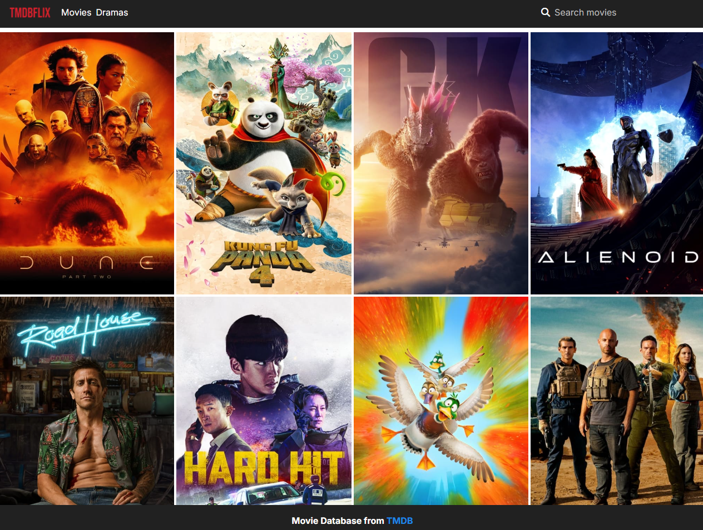

# TMDBFLIX - 영화 데이터베이스 애플리케이션


TMDB API를 활용한 넷플릭스 스타일의 영화 데이터베이스 애플리케이션입니다.

## 🛠 기술 스택

### 핵심 기술

- **Next.js 14.2.4** - App Router를 사용한 React 프레임워크
- **React 18** - UI 라이브러리
- **TypeScript** - 타입 안정성
- **Supabase** - 백엔드 및 데이터베이스

### 상태 관리 & 데이터 페칭

- **Recoil** - 전역 상태 관리
- **TanStack Query (React Query)** - 서버 상태 관리 및 데이터 페칭
- **@supabase/ssr** - Supabase 서버사이드 렌더링 유틸리티

### 스타일링

- **Tailwind CSS** - 유틸리티 우선 CSS 프레임워크
- **@material-tailwind/react** - Material Design 컴포넌트
- **Font Awesome** - 아이콘

### 추가 라이브러리

- **react-intersection-observer** - 무한 스크롤 구현
- **@emotion/react & styled** - CSS-in-JS 스타일링

## 📁 프로젝트 구조

```
├── actions/
│   ├── movieActions.ts       # 영화 데이터 관련 서버 액션
│   └── storageActions.ts     # 스토리지 관련 액션
├── app/
│   ├── movies/              # 영화 상세 페이지
│   ├── globals.css          # 전역 스타일
│   ├── layout.tsx           # 루트 레이아웃
│   └── page.tsx             # 홈페이지
├── components/
│   ├── footer.tsx           # 푸터 컴포넌트
│   ├── header.tsx           # 검색 기능이 포함된 헤더
│   ├── logo.tsx            # 로고 컴포넌트
│   ├── movie-card.tsx      # 영화 카드 컴포넌트
│   └── movie-card-list.tsx # 무한 스크롤 영화 그리드
├── config/
│   ├── ReactQueryClientProvider.tsx
│   ├── RecoilProvider.tsx
│   └── material-tailwind-theme-provider.tsx
└── utils/
    ├── recoil/             # Recoil atoms
    └── supabase/           # Supabase 클라이언트 설정
```

## ✨ 주요 기능 구현

### 1. 서버 사이드 렌더링 & SEO

- Next.js App Router를 활용한 SSR 구현
- 동적 메타데이터 생성으로 SEO 최적화
- 영화 상세 페이지에서 OpenGraph 태그 자동 생성

### 2. 영화 검색 및 목록 표시

- Recoil을 활용한 검색어 전역 상태 관리
- React Query를 사용한 효율적인 데이터 페칭
- 무한 스크롤 구현으로 UX 개선
  - `react-intersection-observer`를 활용한 뷰포트 감지
  - 페이지네이션 데이터 자동 로드

### 3. Supabase 통합

- 서버 및 클라이언트 Supabase 인스턴스 설정
- 영화 데이터 쿼리 및 필터링
- 서버 컴포넌트에서의 데이터 페칭

### 4. 반응형 UI/UX

- Tailwind CSS를 활용한 반응형 디자인
- Material Tailwind 컴포넌트로 일관된 UI
- 다크 테마 스타일링

### 5. 성능 최적화

- 컴포넌트 레벨 클라이언트/서버 분리
- React Query를 활용한 데이터 캐싱
- 이미지 최적화

## 🔍 주요 구현 포인트

1. **검색 기능**

   - Recoil atom을 사용한 검색어 상태 관리
   - 실시간 검색 결과 업데이트

2. **무한 스크롤**

   - `useInfiniteQuery`를 사용한 페이지네이션 데이터 관리
   - Intersection Observer로 스크롤 위치 감지
   - 부드러운 데이터 로딩 UX

3. **영화 상세 정보**

   - 동적 라우팅을 통한 상세 페이지 구현
   - 메타데이터 자동 생성
   - 반응형 레이아웃

4. **데이터 관리**
   - 서버 사이드 액션을 통한 데이터 페칭
   - Supabase 쿼리 최적화
   - 에러 핸들링
